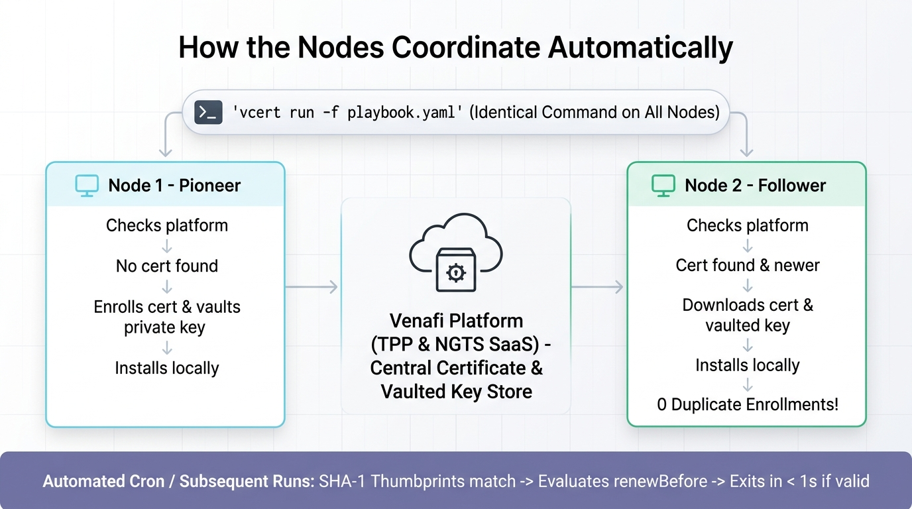

# VCert: `pickupFirst` Extension (GitHub Issue #649)

> **A delta extension to Venafi VCert enabling automated, idempotent certificate and private key convergence across multi-node server clusters.**

[](https://github.com/Venafi/vcert)
[](https://github.com/Venafi/vcert/issues/649)
[](LICENSE)
[](#building-from-source)

---

## 🔗 Upstream Reference

This repository is an **extension fork of the official [Venafi VCert (`Venafi/vcert`)](https://github.com/Venafi/vcert)** project.

* **Upstream Project**: [https://github.com/Venafi/vcert](https://github.com/Venafi/vcert)
* **Official Documentation**: [Venafi Documentation](https://docs.venafi.com) | [CyberArk Certificate Manager](https://docs.cyberark.com)
* **Scope of this Repository**: This repository focuses specifically on the **delta changes** required to resolve [**GitHub Issue #649**](https://github.com/Venafi/vcert/issues/649) (`pickupFirst` mode for Playbooks), supporting both **Venafi TPP** (Self-Hosted) and **CyberArk Certificate Manager SaaS (NGTS)**.

For standard VCert CLI options, PKI setup, and general architecture, please consult the upstream [Venafi/vcert](https://github.com/Venafi/vcert) repository.

---

## 🎯 The Delta: What Does `pickupFirst` Add?

### The Problem
When running automated certificate playbooks in multi-node clusters (load-balanced web servers, API clusters, ingress proxies):
- Every node historically attempted independent enrollment.
- This resulted in **duplicate certificate issuances**, wasted CA quotas/costs, and out-of-sync private keys across nodes.
- Teams had to create brittle external synchronization scripts (rsync, SSH, shared NFS) or maintain separate "leader" vs "follower" playbooks.

### The Solution
With `pickupFirst: true`, **all nodes run the exact same command with the exact same playbook**:

```bash
vcert run -f playbook.yaml
```

* **No custom wrapper scripts.**
* **No separate leader/follower playbooks.**
* **Zero coordination infrastructure needed.**

---

## 📋 Playbook Configuration

Simply add `pickupFirst: true` under `request:` in your certificate task:

```yaml
certificateTasks:
  - name: shared-service-cert
    renewBefore: 1d
    request:
      csr: service
      pickupFirst: true            # <-- Enables automatic multi-node convergence
      zone: 'Private 5 days'       # TPP Zone or NGTS Application/Issuing Template
      subject:
        commonName: 'shared.example.com'
    installations:
      - format: PEM
        file: /etc/ssl/certs/app.crt
        keyFile: /etc/ssl/private/app.key
        chainFile: /etc/ssl/certs/chain.crt
        afterInstallAction: "systemctl reload nginx"
```

---

## 🔄 How the Nodes Coordinate Automatically

<p align="center">
  
</p>

<details>
<summary><b>Click to expand text / ASCII Flowchart</b></summary>

```
                   vcert run -f playbook.yaml
                              │
                 Does cert exist on Platform?
                             ╱ ╲
                       YES ╱     ╲ NO
                         ╱         ╲
      Is Platform newer             Node 1 (First to run):
     than installed cert?           - Falls through & Enrolls cert
            ╱ ╲                     - Key generated on Platform (csr: service)
      YES ╱     ╲ NO (Match)        - Installs cert + key locally
        ╱         ╲
 Node 2 (Follower):  Both Nodes (Cron / Next run):
 - Downloads cert    - Thumbprints match
   + key from DEK    - Checks renewBefore window
 - Installs locally  - If healthy: Exits in < 1s with NO action
 - ZERO enrollment
```

</details>

### Coordination Lifecycle

1. **Whichever node runs first (e.g. Node 1 - The Pioneer)**:
   - Queries the platform for `shared.example.com`.
   - Finds nothing &rarr; automatically falls through to enroll it.
   - The platform generates the private key (`csr: service`) and issues the certificate.
   - Node 1 installs the certificate, private key, and chain locally, then runs `afterInstallAction`.

2. **The other node (Node 2 - The Follower)**:
   - Runs the **identical command**: `vcert run -f playbook.yaml`.
   - Queries the platform for `shared.example.com`.
   - Finds the certificate already enrolled by Node 1.
   - Since Node 2 has no certificate installed yet, it downloads the certificate and the server-side private key (via secure DEK decryption on NGTS, or WebSDK on TPP) and installs them.
   - **Zero duplicate enrollment requests are created.**

3. **Subsequent runs on all nodes (e.g. daily cron)**:
   - Both nodes run `vcert run -f playbook.yaml`.
   - Both inspect their local certificate: the SHA-1 thumbprint matches the platform certificate.
   - Both check `renewBefore`: if still valid, both exit in **< 1 second** with *"certificate in good health. No actions needed"*.
   - When the renewal window hits, whichever node executes first renews the certificate. The other node automatically picks up the renewed certificate and private key on its next run.

---

## ⚖️ The 4-Way Decision Matrix

Before triggering any enrollment, the `pickupFirst` engine evaluates:

| State | Condition | Engine Action |
|---|---|---|
| **Match** | Local thumbprint == Platform thumbprint | Skips download; defers to `renewBefore` check. Exits in < 1s if valid. |
| **Platform Newer** | Platform NotAfter > Local NotAfter (or no local cert) | Downloads certificate + private key + chain, installs, runs `afterInstallAction`. Skips enrollment. |
| **Platform Older** | Platform NotAfter < Local NotAfter | Refuses downgrade with a warning log. Exits cleanly without modifying local files. |
| **Not Found** | No matching cert on platform | Falls through to standard certificate enrollment. |

---

## 🔍 Code Delta Summary (What Changed)

The following table summarizes the files added or modified to implement this feature:

| File | Status | Description |
|---|:---:|---|
| [`pkg/playbook/app/service/pickup_first.go`](pkg/playbook/app/service/pickup_first.go) | **NEW** | Core 4-way decision matrix (`Match`, `PlatformNewer`, `PlatformOlder`, `NotFound`) and state handler. |
| [`pkg/playbook/app/service/service.go`](pkg/playbook/app/service/service.go) | Modified | Hooked `pickupFirstAttempt` into playbook `Execute()` before enrollment checks. |
| [`pkg/playbook/app/domain/playbookRequest.go`](pkg/playbook/app/domain/playbookRequest.go) | Modified | Added `PickupFirst bool` and `PickupID string` fields to `PlaybookRequestCertificate`. |
| [`pkg/playbook/app/installer/crypto.go`](pkg/playbook/app/installer/crypto.go) | Modified | Added `LoadInstalledPEM` to inspect locally installed certificates for SHA-1 fingerprint & expiration. |
| [`pkg/playbook/app/vcertutil/vcertutil.go`](pkg/playbook/app/vcertutil/vcertutil.go) | Modified | Added `LocateLatestCN` (multi-platform discovery for TPP and NGTS) and `PickupCertificateByLocator`. |
| [`pkg/venafi/ngts/connector.go`](pkg/venafi/ngts/connector.go) | Modified | Added `SearchCertificatesByCN`, `SearchCertificatesByFingerprint`, and `GetCertificateDetails`. |
| [`pkg/venafi/ngts/search.go`](pkg/venafi/ngts/search.go) | Modified | Added `CertificateStatus` field to NGTS `Certificate` model. |
| [`pkg/playbook/app/service/pickup_first_test.go`](pkg/playbook/app/service/pickup_first_test.go) | **NEW** | Unit test suite verifying all 4 decision matrix paths and edge cases. |
| [`pkg/playbook/app/vcertutil/vcertutil_test.go`](pkg/playbook/app/vcertutil/vcertutil_test.go) | **NEW** | Unit test suite for locator helpers. |

---

## 🚀 Download Packages & Building

### 📦 Pre-compiled Downloads (All Platforms)

Pre-compiled binary packages matching the official Venafi distribution structure are available on the [**GitHub Releases Page**](https://github.com/tall27/vcert-pickupFirst/releases/tag/v5.13.9-pickupFirst):

| Platform | Architecture | Download Package |
|---|---|---|
| **Linux** | `x86_64` (amd64) | [`vcert_v5.13.9-pickupFirst_linux.zip`](https://github.com/tall27/vcert-pickupFirst/releases/download/v5.13.9-pickupFirst/vcert_v5.13.9-pickupFirst_linux.zip) |
| **Linux** | `ARM64` (aarch64) | [`vcert_v5.13.9-pickupFirst_linux_arm.zip`](https://github.com/tall27/vcert-pickupFirst/releases/download/v5.13.9-pickupFirst/vcert_v5.13.9-pickupFirst_linux_arm.zip) |
| **Linux** | `i386` (32-bit) | [`vcert_v5.13.9-pickupFirst_linux86.zip`](https://github.com/tall27/vcert-pickupFirst/releases/download/v5.13.9-pickupFirst/vcert_v5.13.9-pickupFirst_linux86.zip) |
| **macOS** | Apple Silicon (`arm64`) | [`vcert_v5.13.9-pickupFirst_darwin_arm.zip`](https://github.com/tall27/vcert-pickupFirst/releases/download/v5.13.9-pickupFirst/vcert_v5.13.9-pickupFirst_darwin_arm.zip) |
| **macOS** | Intel (`amd64`) | [`vcert_v5.13.9-pickupFirst_darwin.zip`](https://github.com/tall27/vcert-pickupFirst/releases/download/v5.13.9-pickupFirst/vcert_v5.13.9-pickupFirst_darwin.zip) |
| **Windows** | `x86_64` (amd64) | [`vcert_v5.13.9-pickupFirst_windows.zip`](https://github.com/tall27/vcert-pickupFirst/releases/download/v5.13.9-pickupFirst/vcert_v5.13.9-pickupFirst_windows.zip) |
| **Windows** | `i386` (32-bit) | [`vcert_v5.13.9-pickupFirst_windows86.zip`](https://github.com/tall27/vcert-pickupFirst/releases/download/v5.13.9-pickupFirst/vcert_v5.13.9-pickupFirst_windows86.zip) |
| **Windows** | `ARM64` | [`vcert_v5.13.9-pickupFirst_windows_arm.zip`](https://github.com/tall27/vcert-pickupFirst/releases/download/v5.13.9-pickupFirst/vcert_v5.13.9-pickupFirst_windows_arm.zip) |

---

### Building from Source (Go 1.21+)

#### Windows (`amd64`)
```powershell
go build -ldflags "-X github.com/Venafi/vcert/v5.versionString=v5.13.9-pickupFirst -s -w" -o vcert.exe ./cmd/vcert
.\vcert.exe --version
```

#### Linux (`amd64` / `arm64`)
```bash
GOOS=linux GOARCH=amd64 go build -ldflags "-X github.com/Venafi/vcert/v5.versionString=v5.13.9-pickupFirst -s -w" -o vcert ./cmd/vcert
chmod +x vcert
```

#### macOS (`arm64` / `amd64`)
```bash
GOOS=darwin GOARCH=arm64 go build -ldflags "-X github.com/Venafi/vcert/v5.versionString=v5.13.9-pickupFirst -s -w" -o vcert ./cmd/vcert
```

### Running Unit Tests
```bash
go test -v ./pkg/playbook/app/service -run TestPickupFirst
go test -v ./pkg/playbook/app/vcertutil -run Test
```

---

## 📚 Additional Resources
* **Full Playbook Reference**: [`README-PLAYBOOK.md`](README-PLAYBOOK.md)
* **Upstream VCert Project**: [github.com/Venafi/vcert](https://github.com/Venafi/vcert)

---

## License
Apache 2.0 License - see the [LICENSE](LICENSE) file.
